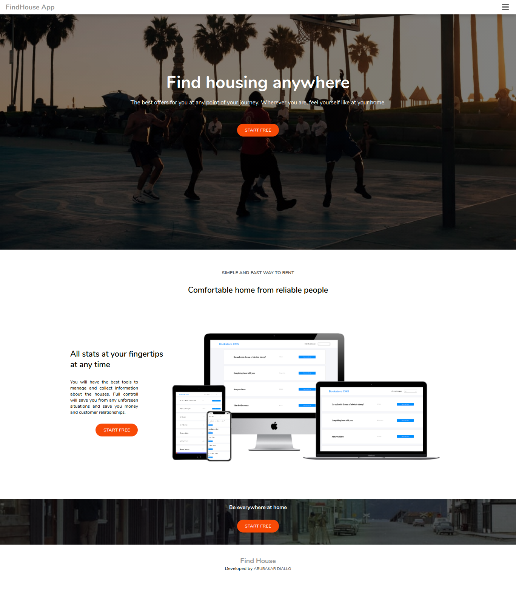

<h1 align="center">Welcome to FindHouse App 👋</h1>
<p>
  
  <a href="https://twitter.com/abruzy01" target="_blank">
    
  </a>
</p>

> This is a simple fullstack app that was built with ReactJS for the frontend and Ruby On Rails for the backend. This app is a mobile web app that contains listings of houses, apartments, rooms etc. On the Home page, when you first visit the app, you can see a short description of the app. Through there you can either sign in or sign up to access the listings. When logged in, the Home page shows all of the listings, from there you can access the Listing Details page or the Favourites page. In the Listing Details page you can see the full details for that house. From the Details page you can also add that particular listing to your list of Favourites, or remove it.



## Built With

- Major languages - JavaScript, HTML5, CSS,
- frameworks - ReactJS, Redux

### ✨ Live Demo

[Live Demo Link](https://findhouse-app.herokuapp.com)

## Getting Started

To get a local copy up and running follow these simple steps.

### Prerequisites

- nodejs must be installed on device

### Install

- Follow this steps according to get you running

1. clone the repo

```sh
git clone git@github.com:abruzy/find_your_house-frontend.git
```
2. change directory 
```sh
cd find_your_house-frontend
```

3. install dependencies

```sh
yarn install
```

4. start the project

```sh
yarn start
```

## Author

👤 **Abubakar Diallo**

* Twitter: [@abruzy01](https://twitter.com/abruzy01)
* Github: [@abruzy](https://github.com/abruzy)
* LinkedIn: [@abubakardiallo](https://linkedin.com/in/abubakardiallo)

## 🤝 Contributing

Contributions, issues and feature requests are welcome!

Feel free to check the [issues page](https://github.com/abruzy/react-bookstore/issues).

## Show your support

Give a ⭐️ if you like this project!

## Acknowledgments

- [Microverse](https://www.microverse.org/)

## 📝 License

This project is [MIT](lic.url) licensed.